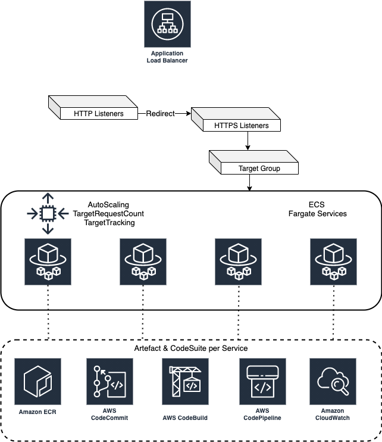

# Terraform Solution

A set of Terraform template used for provisioning different kind application stack on AWS.

Templates are designed to be customized and enhance reusability.

## Components

| Name | Description |
|------|-------------|
| setup-backend | Setup Backend for AWS |  
| vpc-alb-ecs | Create common infrastructure |  
| ecs-fargate-service | ECS Fargate Service  |  

## Catalyst 1. [Fargate Suite]



Dependent Component:

- Step1. setup-backend
- Step2. vpc-alb-ecs
- Step3. ecs-fargate-service

When to use?

1. Need to establish stateless application which can be hosted on ECS Fargate.
2. Establish AWS Code Suite for Git, Continous Integration and Deployment.
3. Generic AutoScaling on the basis of TargetRequestCount.
4. Use Shared Load Balancer & Cluster.
5. Setup VPC, Private and Public Subnet.

## Terraform Version

```bash
$ terraform version
Terraform v1.0.0
```

## Usage

```bash
# Move into the  directory
$ cd <component>

# Initialize Terraform to run
$ terraform init

# Executes the Terraform run
$ terraform apply
```

## Area of contribution/ Future Scope

- Add ECS Host Capabilities.
- ADD ECS Service with EC2 Capabilities.
- Scope of dedicated ALB.
- Manage Secrets and paramter store.
- Mount EBS Disk to ECS Service.

## License

[Apache License](LICENSE)
